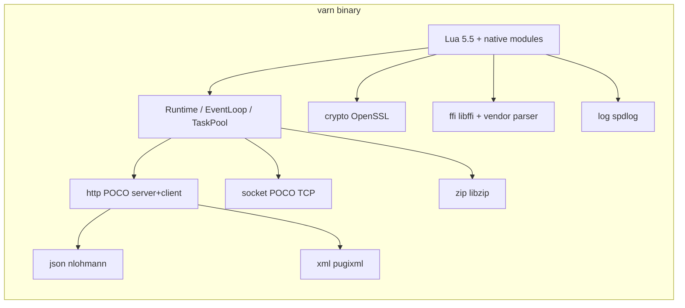

# Architecture overview

## Goals

- **One Lua state, one owning thread.** The Lua C API is used only from the runtime’s main thread. Native code that runs elsewhere must not call Lua directly.
- **Non-blocking scripts.** Blocking I/O and CPU-heavy work run on a worker pool; results return through `Promise` objects resumed on the main loop.
- **HTTP isolation.** The active **HTTP transport** runs I/O on its own threads (or reactor), then forwards each request to the main loop so the user handler always runs in the Lua-owner context.

## Components

```text
┌─────────────────────┐     post(job)      ┌──────────────────┐
│  HTTP transport     │ ─────────────────► │  EventLoop       │
│  or TaskPool worker │                    │  (main thread)   │
└─────────────────────┘                    │  lua_resume /    │
        │                                  │  lua_yield       │
        │                                  └────────┬─────────┘
        │                                           │
        └───────────────────────────────────────────┘
                          Promise::resolve / reject
```

### Dependency sketch (desktop, typical defaults)



Exact links depend on **CMake driver ids**; see [build.md](build.md) and [official-libraries.md](official-libraries.md).

- **`Runtime`** owns the `LuaEngine`, `EventLoop`, `TaskPool`, and any active HTTP server instances. Shutdown stops servers, workers, then the event loop.
- **`EventLoop`** runs on the thread that called `Runtime::runScript` → `mainLoop().run()`. It runs posted jobs sequentially (mutex + condition variable + queue).
- **`TaskPool`** runs a fixed pool of worker threads for blocking work (for example `fs.readFile`).
- **`Promise`** bridges workers to Lua: `resolve` / `reject` synchronize state, then **post** resumption onto the `EventLoop`. Waiters are Lua coroutine registry references; they are resumed only on the main loop.

## Logging

Lua **`log`** and host C++ use the same **`varn::log::Log`** pipeline. **`VARN_LOG_DRIVER`** selects the sink (**`SPDLOG`** by default, **`STDOUT`**, or **`DUMMY`**); see [build.md](build.md).

## WebAssembly

The `varn_wasm` target is a Lua host for the browser shell in **`apps/wasm`**: it does not link the desktop **POCO** HTTP server; **OpenSSL** is not linked on the default WASM configure (**`crypto`** is **`DUMMY`**; see [build.md](build.md#emscripten-wasm)). **`http.createServer` / `socket.tcp`** use **`DUMMY`** stubs.

Outbound **`http.client.request`** uses the browser **`fetch()`** API from **`EM_JS`** (**`VARN_HTTP_CLIENT_DRIVER=EMSCRIPTEN_FETCH`**), the same **`VARN/1`** wire string, and the same **`Promise`** / **`EventLoop::post`** completion path as desktop. **`log`** uses **spdlog**, **`fs`** uses normal I/O (MEMFS when configured), JSON/XML use **nlohmann/json** and **pugixml**, **`ffi`** stays **`DUMMY`**, and **TLS** is off.

**`TaskPool`** has no worker threads: jobs are **queued** and drained by the WASM chunk host after user Lua returns (together with **`EventLoop`** jobs). See [async.md](async.md#emscripten-varn_wasm), [design.md](design.md), and the root [README](../README.md).

## Further reading

- [Design overview & doc index](design.md)
- [Concurrency and async](async.md)
- [Native modules](native-modules.md)
- [Build and drivers](build.md)
- [Official libraries](official-libraries.md) (vendor mapping only)
- [Security notes](security.md) (trust boundaries for embedders)
- [WASM HTTP roadmap](wasm-http-roadmap.md) (client enhancements beyond the current `fetch` bridge)
